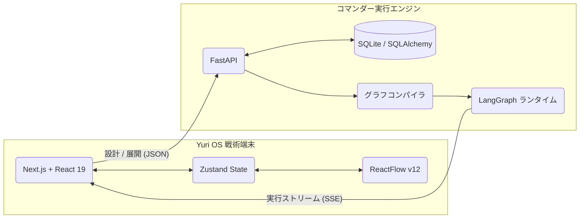

# Yuri OS 🪐
<div align="center">
  <p><strong>生成型エージェントワークフロービルダー ＆ オペレーティングシステム</strong></p>

  [](https://opensource.org/licenses/MIT)
  [](https://nextjs.org/)
  [](https://fastapi.tiangolo.com/)
  [](https://python.langchain.com/docs/langgraph)

  <p>
    <a href="README.md">English</a> | <a href="README.zh-CN.md">简体中文</a> | <a href="README.ja.md">日本語</a>
  </p>
</div>

Yuri OSは、大規模言語モデル（LLM）エージェント向けに設計された、野心的で高度に視覚化されたオーケストレーションプラットフォームです。従来の「ドラッグ＆ドロップ」パラダイムを超え、**生成型ワークフロー（Generative Workflows）** を導入しています。

あなたは**最高司令官**として、自然言語による指示をコマンダーAIに伝えます。システムは、完全に機能する複雑なマルチエージェント有向非巡回グラフ（DAG）を動的に設計、構築し、あなたの戦術キャンバス上に直接展開します。

<div align="center">
  
</div>

---

## 📖 目次
- [✨ 主な機能](#-主な機能)
- [📸 ワークフローデモ](#-ワークフローデモ)
- [🏗️ システムアーキテクチャ](#️-システムアーキテクチャ)
- [💡 ユースケース](#-ユースケース)
- [🚀 クイックスタート](#-クイックスタート)
- [⚙️ 設定](#️-設定)
- [🗺️ ロードマップ](#️-ロードマップ)
- [🤝 貢献](#-貢献)
- [📄 ライセンス](#-ライセンス)

---

## ✨ 主な機能

### 🧠 生成型ワークフローアーキテクチャ
手動でのノード接続はもう必要ありません。「AIニュースを検索し、上位3つの記事を要約し、フランス語に翻訳するパイプラインを構築して」のように目標を説明するだけです。コマンダーAIがインテリジェントに必要な役割を決定し、高度に専門化されたシステムプロンプトを生成し、ロジックフローをReactFlowキャンバスに瞬時にマッピングします。

### ⛓️ LangGraph実行エンジン
Yuri OSは単なるUIではなく、堅牢なランタイムです。バックエンドは、視覚的なトポロジーを実行可能なLangGraphの `StateGraph` ワークフローに直接変換します。条件ルーティング（`Condition` ノード）、状態管理、およびエージェントノード間の厳格なデータフローをネイティブに処理します。

### ⚡ リアルタイムストリーミング (SSE)
エージェントの群れが思考する様子をリアルタイムで観察できます。実行ログ、中間データ、最終出力は、Server-Sent Eventsを介してフロントエンドのコマンドセンターに直接ストリーミングされ、常に作戦の状況を把握できます。

### 🎨 ソビエト/サイバーパンクな端末の美学
Tailwind CSS v4で細部までこだわって構築されたUIは、深く没入できる未来的な戦術コマンドの美学を体現しています。`oklch` 色空間、発光ネオンフィルター、およびターミナルスタイルのタイポグラフィを利用して、ワークフローの構築を映画のような体験に変えます。

### 🌐 多言語インターフェース (i18n)
**English**・**简体中文**・**日本語** のリアルタイム切り替えに完全対応。UI・ステータスメッセージ・AIが生成するエージェントコンテンツ（ラベル・説明・System Prompt）すべてが、ページリロードなしで選択した言語に即座に切り替わります。

### 🗂️ エージェントロールシステム
ワークフロー内の各ノードには専用の **ロール (Role)** が割り当てられ、動作・UIテーマ・デフォルトPrompt戦略を決定します：

| ロール | 説明 |
|--------|------|
| `searcher` | Webクローラー / 外部データ取得 |
| `summarizer` | 長文テキストの要約・要点抽出 |
| `coder` | 自然言語要件 → 実行可能なコード |
| `formatter` | 生データ → 整形済み JSON / CSV / XML |
| `writer` | 長文コンテンツ作成・レポート生成 |
| `default` | 汎用ロジック推論（万能ハブ） |
| `condition` | 条件分岐ノード — True / False の2ルートへ振り分け |

---

## 📸 ワークフローデモ

> **ステップ1 → ステップ2 → ステップ3**：自然言語で目標を記述 → コマンダーAIがマルチエージェントプランを生成 → ワンクリックでキャンバスにデプロイ。

<table>
  <tr>
    <td align="center" width="33%">
      
      <br/>
      <sub><b>① コマンダーターミナル</b><br/>自然言語で戦術指示を入力</sub>
    </td>
    <td align="center" width="33%">
      
      <br/>
      <sub><b>② AIプラン生成</b><br/>アーキテクチャ自動生成、デプロイ承認待ち</sub>
    </td>
    <td align="center" width="33%">
      
      <br/>
      <sub><b>③ 戦術デプロイ</b><br/>ライブDAGがキャンバスに展開完了</sub>
    </td>
  </tr>
</table>

---

## 🏗️ システムアーキテクチャ

Yuri OSは、関心の分離（Separation of Concerns）を明確にし、最新のReactエコシステムとPythonのAIネイティブバックエンドを橋渡ししています。



---

## 💡 ユースケース

- **自律型リサーチスウォーム**: `searcher` ノードを展開してデータを収集し、それを `summarizer` に渡して、最終的に `writer` が包括的なレポートを作成します。
- **自動コードレビューパイプライン**: `coder` がプルリクエストを分析し、`condition` ノードがセキュリティの脆弱性をチェックして、最終出力のために `formatter` にルーティングするワークフローを設定します。
- **多言語コンテンツファクトリー**: 翻訳ノードを並行して接続し、1つの入力を複数の地域向け出力に同時にブロードキャストします。

---

## 🚀 クイックスタート

### 1. 前提条件
- Node.js 20+
- Python 3.10+
- 有効なLLM APIキー（OpenAI、DeepSeekなど）

### 2. リポジトリのクローン
```bash
git clone https://github.com/tiand23/yuri-os.git
cd yuri-os
```

### 3. バックエンドのセットアップ
```bash
cd backend

# 仮想環境の作成と有効化
python -m venv venv
source venv/bin/activate  # Windowsの場合: venv\Scripts\activate

# 依存関係のインストール
pip install -r requirements.txt

# 環境変数の設定
cp .env.example .env
# .envを編集し、OPENAI_API_KEYとOPENAI_BASE_URLを入力します

# FastAPIエンジンの起動
uvicorn main:app --reload --port 8000
```

### 4. フロントエンドのセットアップ
```bash
cd frontend

# 依存関係のインストール
npm install

# 開発サーバーの起動
npm run dev
```

`http://localhost:3121` にアクセスして、コマンダーターミナルを開きます。

---

## ⚙️ 設定

バックエンドの `.env` ファイルは、**コマンダーAI** を駆動するLLMを制御します。

```env
# .env ファイルの例
OPENAI_API_KEY=sk-your-api-key-here
OPENAI_BASE_URL=https://api.openai.com/v1
OPENAI_MODEL=gpt-4o  # deepseek-chat, claude-3-opus なども使用可能です
```

---

## 🗺️ ロードマップ

- [ ] **Docker化**: 真のワンクリックデプロイメントのために `docker-compose.yml` を提供します。
- [ ] **巡回グラフのサポート**: LangGraph内の再帰的なループ（サイクル）を安全にサポートするようにコンパイラを拡張します。
- [ ] **マルチユーザー認証**: JWT認証を実装して、チームベースのワークスペースの分離を可能にします。
- [ ] **ツールの統合**: エージェントが動的なツール（Webブラウジング、ファイルI/O、SQL実行）を装備できるようにします。

---

## 🤝 貢献

コミュニティからのあらゆる貢献を歓迎します！UIのバグ修正、LangGraphコンパイラの最適化、新しいエージェントの役割の追加など、何でも大歓迎です。

1. リポジトリをForkする
2. フィーチャーブランチを作成する (`git checkout -b feature/amazing-feature`)
3. 変更をコミットする (`git commit -m 'Add amazing feature'`)
4. ブランチにプッシュする (`git push origin feature/amazing-feature`)
5. [Pull Request](https://github.com/tiand23/yuri-os/pulls) を作成する

大きな変更については、まず [Issue](https://github.com/tiand23/yuri-os/issues) を開いて議論してください。

---

## 📄 ライセンス

このプロジェクトは [MITライセンス](LICENSE) の下でライセンスされています。
