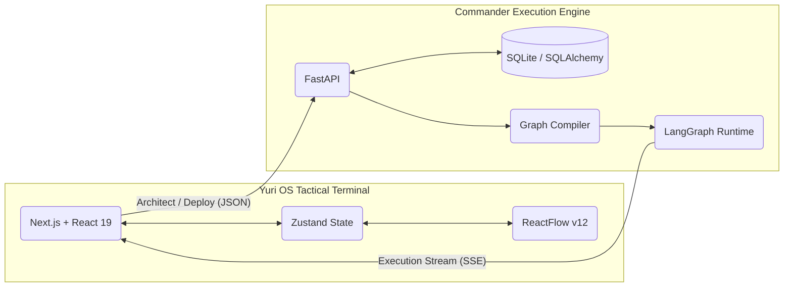

# Yuri OS 🪐
<div align="center">
  <p><strong>A Generative Node-based Agentic Workflow Builder & OS</strong></p>

  [](https://opensource.org/licenses/MIT)
  [](https://nextjs.org/)
  [](https://fastapi.tiangolo.com/)
  [](https://python.langchain.com/docs/langgraph)

  <p>
    <a href="README.md">English</a> | <a href="README.zh-CN.md">简体中文</a> | <a href="README.ja.md">日本語</a>
  </p>
</div>

Yuri OS is an ambitious, highly visual orchestration platform designed for Large Language Model (LLM) agents. We move beyond the traditional "drag-and-drop" paradigm by introducing **Generative Workflows**. 

As the **Supreme Commander**, you issue natural language directives to the Commander AI. The system dynamically architects, provisions, and deploys a fully functional, highly complex Multi-Agent Directed Acyclic Graph (DAG) directly onto your tactical canvas.

<div align="center">
  
</div>

---

## 📖 Table of Contents
- [✨ Key Features](#-key-features)
- [📸 Workflow Demo](#-workflow-demo)
- [🏗️ System Architecture](#️-system-architecture)
- [💡 Use Cases](#-use-cases)
- [🚀 Quick Start](#-quick-start)
- [⚙️ Configuration](#️-configuration)
- [🗺️ Roadmap](#️-roadmap)
- [🤝 Contributing](#-contributing)
- [📄 License](#-license)

---

## ✨ Key Features

### 🧠 Generative Workflow Architecture
Stop manually wiring nodes. Describe your goal (e.g., *"Build a pipeline that searches for AI news, summarizes the top 3 articles, and translates them into French"*). The Commander AI will intelligently determine the required roles, generate highly specialized System Prompts, and map the logic flow onto a ReactFlow canvas instantly.

### ⛓️ LangGraph Execution Engine
Yuri OS isn't just a UI—it's a robust runtime. The backend translates your visual topology directly into executable LangGraph `StateGraph` workflows. It natively handles conditional routing (`Condition` nodes), state management, and strict data flow between agent nodes.

### ⚡ Real-Time Streaming (SSE)
Watch your agent swarm think in real-time. Execution logs, intermediate data payloads, and final outputs are streamed directly to the frontend command center via Server-Sent Events, ensuring you are always in control of the operation.

### 🎨 Soviet-Cyberpunk Terminal Aesthetics
Built meticulously with Tailwind CSS v4, the UI embraces a highly immersive, futuristic tactical command aesthetic. Utilizing the `oklch` color space, glowing neon filters, and terminal-style typographies, it transforms workflow building into a cinematic experience.

### 🌐 Multilingual Interface (i18n)
Full support for **English**, **简体中文**, and **日本語**. The UI, all status messages, and AI-generated agent content (labels, descriptions, system prompts) all adapt to the selected language in real time—no page reload required.

### 🗂️ Agent Role System
Each node in the workflow is assigned a specialized **Role** that determines its behavior, UI theme, and default prompt strategy:

| Role | Description |
|------|-------------|
| `searcher` | Web crawler / data retrieval agent |
| `summarizer` | Long-text distillation and key-point extraction |
| `coder` | Natural language → executable code compiler |
| `formatter` | Raw / dirty data → structured JSON / CSV / XML |
| `writer` | Long-form content drafting and copywriting |
| `default` | General-purpose reasoning agent |
| `condition` | Conditional branch node — routes flow True / False |

---

## 📸 Workflow Demo

> **Step 1 → Step 2 → Step 3**: Describe your goal in natural language → Commander AI generates the multi-agent plan → One click deploys the live workflow onto the canvas.

<table>
  <tr>
    <td align="center" width="33%">
      
      <br/>
      <sub><b>① Commander Terminal</b><br/>Issue directives in natural language</sub>
    </td>
    <td align="center" width="33%">
      
      <br/>
      <sub><b>② AI Plan Generation</b><br/>Architecture auto-generated, awaiting approval</sub>
    </td>
    <td align="center" width="33%">
      
      <br/>
      <sub><b>③ Tactical Deployment</b><br/>Live DAG deployed on the canvas</sub>
    </td>
  </tr>
</table>

---

## 🏗️ System Architecture

Yuri OS operates on a clean separation of concerns, bridging modern React ecosystems with Python's AI-native backend.



---

## 💡 Use Cases

- **Autonomous Research Swarms**: Deploy a `searcher` node to scrape data, passing it to a `summarizer`, and finally a `writer` to draft a comprehensive report.
- **Automated Code Review Pipelines**: Set up a workflow where a `coder` analyzes a pull request, a `condition` node checks for security vulnerabilities, and routes to a `formatter` for final output.
- **Multi-lingual Content Factories**: Connect translation nodes in parallel to broadcast single inputs into multiple regional outputs simultaneously.

---

## 🚀 Quick Start

### 1. Prerequisites
- Node.js 20+
- Python 3.10+
- A valid LLM API Key (OpenAI, DeepSeek, etc.)

### 2. Clone the Repository
```bash
git clone https://github.com/tiand23/yuri-os.git
cd yuri-os
```

### 3. Backend Setup
```bash
cd backend

# Create and activate virtual environment
python -m venv venv
source venv/bin/activate  # Windows: venv\Scripts\activate

# Install dependencies
pip install -r requirements.txt

# Configure Environment Variables
cp .env.example .env
# Edit .env and insert your OPENAI_API_KEY and OPENAI_BASE_URL

# Start the FastAPI engine
uvicorn main:app --reload --port 8000
```

### 4. Frontend Setup
```bash
cd frontend

# Install dependencies
npm install

# Start the development server
npm run dev
```

Visit `http://localhost:3121` to access the Commander Terminal.

---

## ⚙️ Configuration

Your backend `.env` file controls the LLM powering the **Commander AI**.

```env
# Example .env file
OPENAI_API_KEY=sk-your-api-key-here
OPENAI_BASE_URL=https://api.openai.com/v1
OPENAI_MODEL=gpt-4o  # You can use deepseek-chat, claude-3-opus, etc.
```

---

## 🗺️ Roadmap

- [ ] **Dockerization**: Provide a `docker-compose.yml` for true one-click deployment.
- [ ] **Cyclic Graph Support**: Enhance the compiler to safely support recursive loops (cycles) in LangGraph.
- [ ] **Multi-User Auth**: Implement JWT authentication to allow team-based workspace isolation.
- [ ] **Tool Integration**: Allow agents to equip dynamic tools (Web Browsing, File I/O, SQL Execution).

---

## 🤝 Contributing

We welcome all contributions from the community! Whether it's fixing a UI bug, optimizing the LangGraph compiler, or adding new Agent Roles.

1. Fork the repository
2. Create your feature branch (`git checkout -b feature/amazing-feature`)
3. Commit your changes (`git commit -m 'Add amazing feature'`)
4. Push to the branch (`git push origin feature/amazing-feature`)
5. Open a [Pull Request](https://github.com/tiand23/yuri-os/pulls)

For major changes, please open an [Issue](https://github.com/tiand23/yuri-os/issues) first to discuss what you'd like to change.

---

## 📄 License

This project is licensed under the [MIT License](LICENSE).
