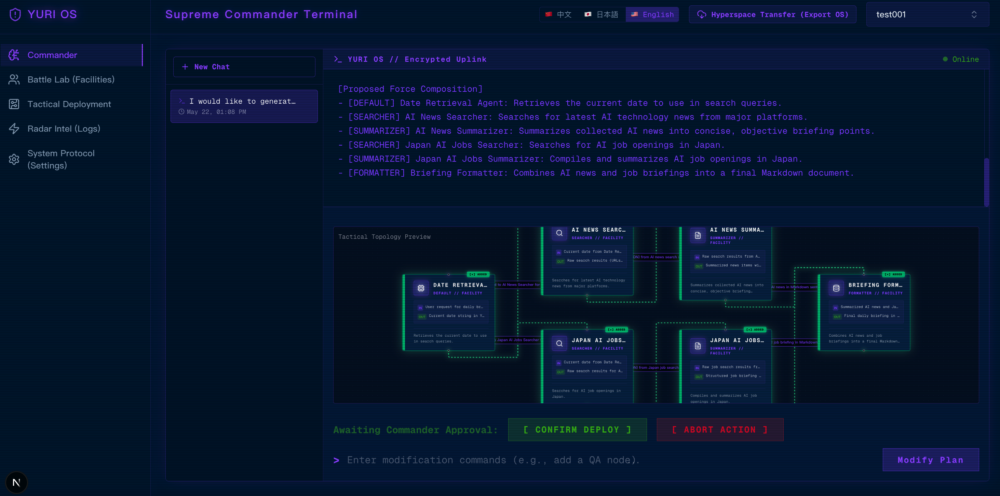
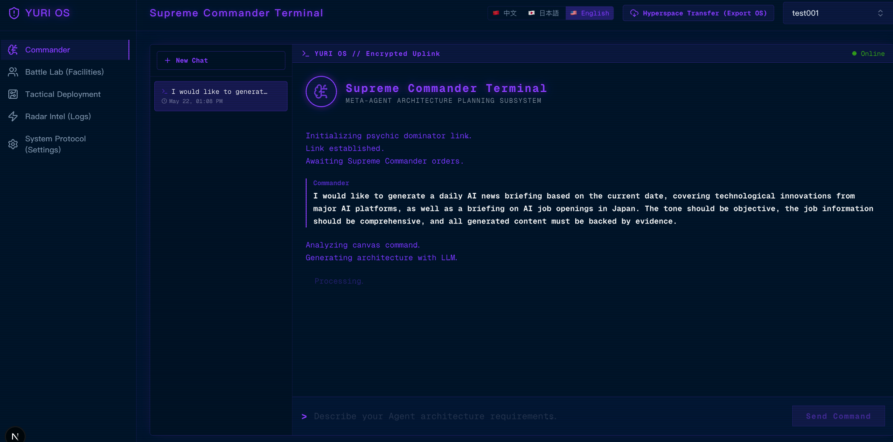
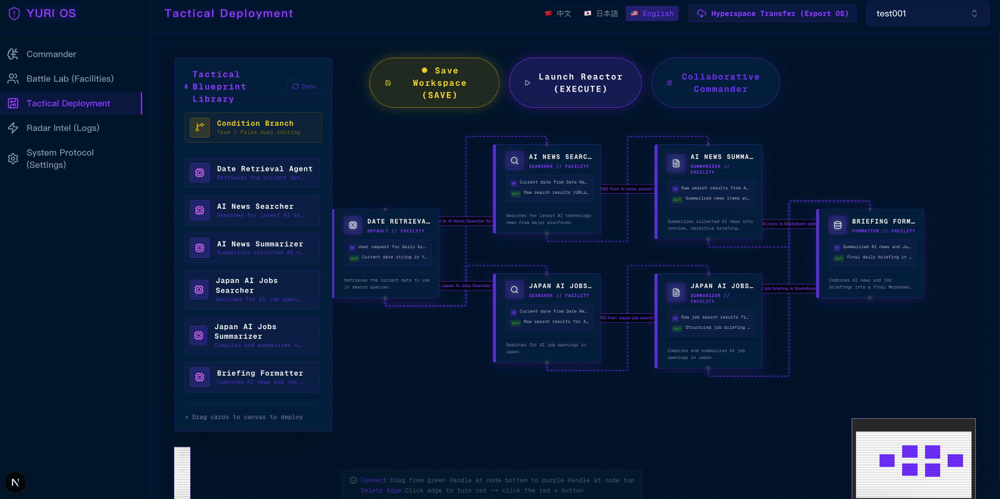
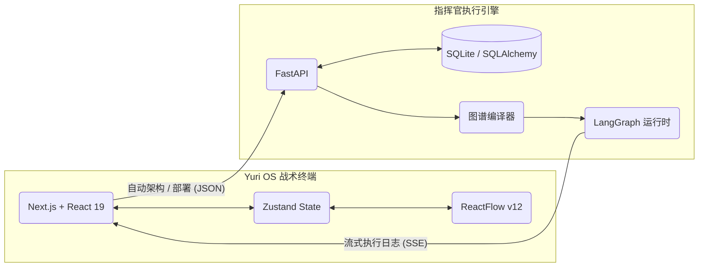

# Yuri OS 🪐
<div align="center">
  <p><strong>生成式智能体工作流可视化编排引擎 / 战术操作系统</strong></p>

  [](https://opensource.org/licenses/MIT)
  [](https://nextjs.org/)
  [](https://fastapi.tiangolo.com/)
  [](https://python.langchain.com/docs/langgraph)

  <p>
    <a href="README.md">English</a> | <a href="README.zh-CN.md">简体中文</a> | <a href="README.ja.md">日本語</a>
  </p>
</div>

Yuri OS 是一个极具前瞻性的大语言模型 (LLM) 智能体编排平台。我们打破了传统的“手动拖拽节点”范式，引入了**生成式工作流 (Generative Workflows)** 的概念。

在这里，你将扮演**最高指挥官**：只需在终端用自然语言下达指令，指挥官 AI 就会在后台瞬间推演战术，为你自动架构、配置并部署一个完整、复杂的多智能体有向无环图 (DAG) 到你的战术画布上。

<div align="center">
  
</div>

---

## 📖 目录
- [✨ 核心特性](#-核心特性)
- [📸 工作流演示](#-工作流演示)
- [🏗️ 系统架构](#️-系统架构)
- [💡 应用场景](#-应用场景)
- [🚀 快速启动](#-快速启动)
- [⚙️ 环境配置](#️-环境配置)
- [🗺️ 开发路线图](#️-开发路线图)
- [🤝 参与贡献](#-参与贡献)
- [📄 开源协议](#-开源协议)

---

## ✨ 核心特性

### 🧠 生成式工作流架构
告别繁琐的手动连线。只需描述你的目标（例如：*“构建一个流程，先搜索关于AI的新闻，总结排名前三的文章，最后翻译成法语”*），指挥官 AI 就会智能分配角色、生成极度专业详细的 System Prompts，并瞬间将逻辑拓扑渲染到 ReactFlow 画布上。

### ⛓️ LangGraph 执行引擎
Yuri OS 绝不仅仅是一个花哨的 UI——它拥有强悍的运行时底座。后端会将你的可视化拓扑图直接编译为可执行的 LangGraph `StateGraph` 工作流。它原生支持逻辑条件路由（`Condition` 节点）、状态保持以及严格的节点间数据流转。

### ⚡ 实时流式监控 (SSE)
亲眼看着你的智能体集群思考！所有的执行日志、中间态数据以及最终输出，都会通过 Server-Sent Events (SSE) 毫秒级推送到前端的总控面板，确保你对战局了如指掌。

### 🎨 苏联/赛博朋克 终端美学
基于 Tailwind CSS v4 精心打磨的重度沉浸式 UI。广泛运用了现代化的 `oklch` 色彩空间、发光霓虹滤镜和复古终端排版，将枯燥的工作流编排变成了一场极具电影感的”战术指挥”体验。

### 🌐 多语言界面 (i18n)
完整支持 **英文**、**简体中文** 和 **日本語** 实时切换。UI 界面、所有状态消息以及 AI 生成的 Agent 内容（名称、描述、System Prompt）均随语言选择实时更新，无需刷新页面。

### 🗂️ Agent 角色系统
工作流中每个节点都具有专属的 **角色 (Role)**，角色决定了其行为模式、UI 主题与默认 Prompt 策略：

| 角色 | 职责说明 |
|------|---------|
| `searcher` | 网络爬虫 / 外部数据检索 |
| `summarizer` | 长文本提炼与核心要点抽取 |
| `coder` | 自然语言需求 → 可执行代码 |
| `formatter` | 原始/脏数据 → 规范化 JSON / CSV / XML |
| `writer` | 长文写作、文案创作与报告生成 |
| `default` | 通用逻辑推理（万能中枢） |
| `condition` | 条件分支节点，根据判断结果路由至 True / False 两条链路 |

---

## 📸 工作流演示

> **第一步 → 第二步 → 第三步**：用自然语言描述目标 → 指挥官 AI 自动生成多智能体方案 → 一键部署到战术画布。

<table>
  <tr>
    <td align="center" width="33%">
      
      <br/>
      <sub><b>① 指挥官终端</b><br/>用自然语言下达战术指令</sub>
    </td>
    <td align="center" width="33%">
      
      <br/>
      <sub><b>② AI 方案生成</b><br/>架构自动推演完成，等待批准部署</sub>
    </td>
    <td align="center" width="33%">
      
      <br/>
      <sub><b>③ 战术部署</b><br/>实时 DAG 工作流部署上线</sub>
    </td>
  </tr>
</table>

---

## 🏗️ 系统架构

Yuri OS 采用了清晰的前后端分离架构，完美融合了现代 React 生态与 Python 的 AI 原生底座。



---

## 💡 应用场景

- **全自动研究集群**：部署一个 `searcher` 节点去爬取数据，传给 `summarizer` 进行总结，最后交给 `writer` 撰写出一份深度的研究报告。
- **代码自动化审查管线**：让 `coder` 节点分析 PR 代码，配合 `condition` 条件节点判断是否存在安全漏洞，最后路由到 `formatter` 进行代码美化。
- **多语言内容矩阵**：并行连接多个翻译节点，将单次输入的内容瞬间分发为支持多国语言的本地化内容。

---

## 🚀 快速启动

### 1. 环境准备
- Node.js 20+
- Python 3.10+
- 有效的大模型 API Key（OpenAI, DeepSeek, Claude 等均可）

### 2. 克隆代码仓库
```bash
git clone https://github.com/tiand23/yuri-os.git
cd yuri-os
```

### 3. 部署后端引擎
```bash
cd backend

# 创建并激活 Python 虚拟环境
python -m venv venv
source venv/bin/activate  # Windows 环境使用: venv\Scripts\activate

# 安装依赖
pip install -r requirements.txt

# 配置环境变量
cp .env.example .env
# 编辑 .env 文件，填入你的 OPENAI_API_KEY 和 OPENAI_BASE_URL

# 启动 FastAPI 服务
uvicorn main:app --reload --port 8000
```

### 4. 部署前端控制台
```bash
cd frontend

# 安装依赖
npm install

# 启动开发服务器
npm run dev
```

在浏览器中打开 `http://localhost:3121` 即可进入指挥官终端。

---

## ⚙️ 环境配置

后端的 `.env` 文件是驱动 **指挥官 AI** 的核心。

```env
# .env 示例
OPENAI_API_KEY=sk-your-api-key-here
OPENAI_BASE_URL=https://api.openai.com/v1
OPENAI_MODEL=gpt-4o  # 你可以随意切换为 deepseek-chat, claude-3-opus 等模型
```

---

## 🗺️ 开发路线图

- [ ] **Docker 容器化**：提供完整的 `docker-compose.yml`，实现真正的“一键起飞”。
- [ ] **有环图 (Cyclic Graph) 支持**：增强编译器逻辑，安全支持包含死循环或反馈回路的复杂 LangGraph 工作流。
- [ ] **多租户权限认证**：引入 JWT 鉴权，支持团队协作与工作区隔离。
- [ ] **动态工具 (Tools) 挂载**：允许 Agent 在运行时动态调用工具（如网页浏览、文件读写、SQL 执行）。

---

## 🤝 参与贡献

我们极其欢迎来自社区的任何贡献！无论是修复一个不起眼的 UI Bug、优化 LangGraph 编译器的性能，还是新增酷炫的 Agent Role。

1. Fork 本仓库
2. 创建功能分支 (`git checkout -b feature/amazing-feature`)
3. 提交改动 (`git commit -m 'Add amazing feature'`)
4. 推送到分支 (`git push origin feature/amazing-feature`)
5. 发起 [Pull Request](https://github.com/tiand23/yuri-os/pulls)

提交大型改动前，建议先开一个 [Issue](https://github.com/tiand23/yuri-os/issues) 与我们探讨方案。

---

## 📄 开源协议

本项目采用 [MIT 协议](LICENSE) 予以开源授权。
